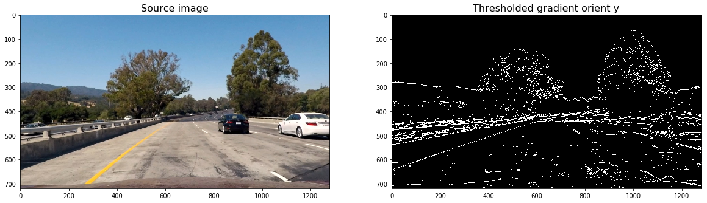
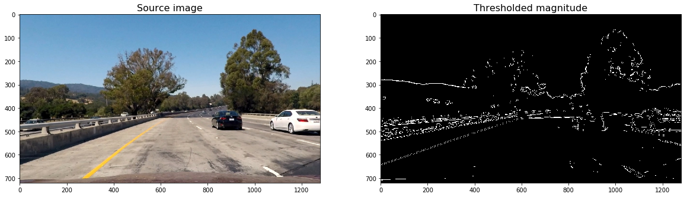
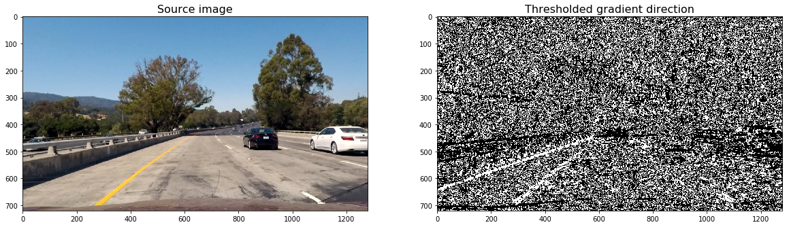
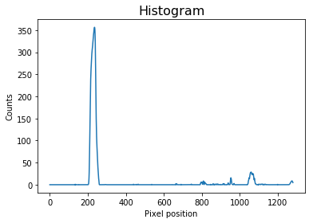
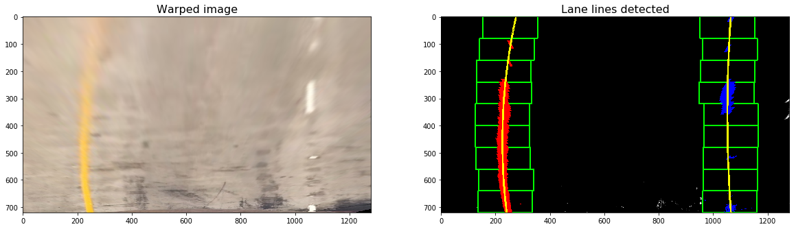

## Advanced Lane Finding
[](http://www.udacity.com/drive)


The Project
---

My pipeline consists of the following steps:

* Compute the camera calibration matrix and distortion coefficients given a set of chessboard images.
* Apply a distortion correction to raw images.
* Use color transforms, gradients, etc., to create a thresholded binary image.
* Apply a perspective transform to rectify binary image ("birds-eye view").
* Detect lane pixels and fit to find the lane boundary.
* Determine the curvature of the lane and vehicle position with respect to center.
* Warp the detected lane boundaries back onto the original image.
* Output visual display of the lane boundaries and numerical estimation of lane curvature and vehicle position.

### Pipeline

#### Camera Calibration

The first step is to perform a camera calibration. A series of chessboard images are used for this purpose.

I have defined the `calibrate_camera` function which takes as input parameters an array of paths to chessboards images, and the number of inside corners in the _x_ and _y_ axis.

For each image path, `calibrate_camera`:
- reads the image by using the OpenCV [cv2.imread](https://docs.opencv.org/3.0-beta/doc/py_tutorials/py_gui/py_image_display/py_image_display.html) function, 
- converts it to grayscale usign [cv2.cvtColor](https://docs.opencv.org/3.0.0/df/d9d/tutorial_py_colorspaces.html), 
- find the chessboard corners usign [cv2.findChessboardCorners](https://docs.opencv.org/2.4/modules/calib3d/doc/camera_calibration_and_3d_reconstruction.html?highlight=calib)

Finally, the function uses all the chessboard corners to calibrate the camera by invoking [cv2.calibrateCamera](https://docs.opencv.org/3.0-beta/doc/py_tutorials/py_calib3d/py_calibration/py_calibration.html).

The values returned by `cv2.calibrateCamera` will be used later to undistort our video images.

#### Applying distortion correction to raw images

Another OpenCv funtion, [cv2.undistort](https://docs.opencv.org/3.0-beta/doc/py_tutorials/py_calib3d/py_calibration/py_calibration.html), will be used to undistort images.

Below, it can be observed the result of undistorting one of the chessboard images:


#### Color Transforms, gradients to create a thresholded binary image.

In this step, we will define the following funtions to calculate several gradient measurements (x, y, magnitude, direction and color).

- Calculate directional gradient: `abs_sobel_thresh()`.
- Calculate gradient magnitude: `mag_thres()`.
- Calculate gradient direction: `dir_thresh()`.
- Calculate color threshold: `col_thresh()`.

Then, `combine_threshs()` will be used to combine these thresholds, and produce the image which will be used to identify lane lines in later steps.

Below, I have copied the result of applying each function to a sample image:

- Calculate directional gradient for _x_ and _y_ orients:



- Calculate gradient magnitude 



- Calculate gradient direction 


- Calculate color threshold


The output image resulting of combining each thresh can be observed below:


An in-depth explanation about how these functions work can be found at the [Lesson 15: Advanced Techniques for Lane Finding](https://classroom.udacity.com/nanodegrees/nd013/parts/fbf77062-5703-404e-b60c-95b78b2f3f9e/modules/2b62a1c3-e151-4a0e-b6b6-e424fa46ceab/lessons/096009a1-3d76-4290-92f3-055961019d5e/concepts/016c6236-7f8c-4c07-8232-a3d099c5454a) of Udacity's [Self Driving Car Engineer Nanodegree](https://www.udacity.com/course/self-driving-car-engineer-nanodegree--nd013). 


#### Apply perspective transform to rectify the binary image (Bird eye-view)

The process to do that is quite simple:

- First, you need to select the coordinates corresponding to a [trapezoid](https://en.wikipedia.org/wiki/Trapezoid) in the image, but which would look like a rectangle from _birds_eye_ view.
- Then, you have to define the destination coordinates, or how that trapezoid would look from _birds_eye_ view. 
- Finally, Opencv function [cv2.getPerspectiveTransform](https://docs.opencv.org/2.4/modules/imgproc/doc/geometric_transformations.html#getperspectivetransform) will be used to calculate both, the perpective transform _M_ and the inverse perpective transform _Minv.
- _M_ and _Minv_ will be used respectively to warp and unwarp the video images.

Please find below the result of warping an image after transforming its perpective to birds-eye view:


The `warp()` function takes as inputs an image (`img`), as well as source (`src`) and destination (`dst`) points.  I chose the hardcode the source and destination points in the following manner:

```python
```python
# Define perspective transform function
def warp(img, src_coordinates=None, dst_coordinates=None):
    # Define calibration box in source (original) and destination (desired or warped) coordinates
    img_size = (img.shape[1], img.shape[0])
    
    
    if src_coordinates is None:
        src_coordinates = np.float32(
            [[280,  700],  # Bottom left
             [595,  460],  # Top left
             [725,  460],  # Top right
             [1125, 700]]) # Bottom right
        
    if dst_coordinates is None:
        dst_coordinates = np.float32(
            [[250,  720],  # Bottom left
             [250,    0],  # Top left
             [1065,   0],  # Top right
             [1065, 720]]) # Bottom right   

    # Compute the perspective transfor, M
    M = cv2.getPerspectiveTransform(src_coordinates, dst_coordinates)

    
    # Compute the inverse perspective transfor also by swapping the input parameters
    Minv = cv2.getPerspectiveTransform(dst_coordinates, src_coordinates)
    
    # Create warped image - uses linear interpolation
    warped = cv2.warpPerspective(img, M, img_size, flags=cv2.INTER_LINEAR)

    return warped, M, Minv
```

 Please notice that the function does not return the unwarped version of the image. That would be performed in a later step.
```

#### Detect lane pixels and fit to find the lane boundary.

 In order to detect the lane pixels from the warped image, the following steps are performed.
 
 - First, a histogram of the lower half of the warped image is created. Below it can be seen the histogram and the code used to produce it.




```python
def get_histogram(img):
    return np.sum(img[img.shape[0]//2:, :], axis=0)

# Run de function over the combined warped image
combined_warped = warp(combined)[0]
histogram = get_histogram(combined_warped)

# Plot the results
plt.title('Histogram', fontsize=16)
plt.xlabel('Pixel position')
plt.ylabel('Counts')
plt.plot(histogram)
```

- Then, the starting left and right lanes positions are selected by looking to the max value of the histogram to the left and the right of the histogram's mid position.
- A technique known as _Sliding Window_ is used to identify the most likely coordinates of the lane lines in a window, which slides vertically through the image for both the left and right line.
- Finally, usign the coordinates previously calculated, a second order polynomial is calculated for both the left and right lane line. Numpy's function [np.polyfit](https://docs.scipy.org/doc/numpy/reference/generated/numpy.polyfit.html) will be used to calculate the polynomials.

Please find below the result of applying the `detect_lines()` function to the warped image:



#### Radius of curvature and position of vehicle calculation

At this moment, some metrics will be calculated: the radius of curvature and the car offset.

The code is quite self-explicative, so refer to its lecture. For further information, please refer to  [Lesson 15: Advanced Techniques for Lane Finding](https://classroom.udacity.com/nanodegrees/nd013/parts/fbf77062-5703-404e-b60c-95b78b2f3f9e/modules/2b62a1c3-e151-4a0e-b6b6-e424fa46ceab/lessons/096009a1-3d76-4290-92f3-055961019d5e/concepts/016c6236-7f8c-4c07-8232-a3d099c5454a) of Udacity's [Self Driving Car Engineer Nanodegree](https://www.udacity.com/course/self-driving-car-engineer-nanodegree--nd013). 

```python
def curvature_radius (leftx, rightx, img_shape, xm_per_pix=3.7/800, ym_per_pix = 25/720):
    ploty = np.linspace(0, img_shape[0] - 1, img_shape[0])
    
    leftx = leftx[::-1]  # Reverse to match top-to-bottom in y
    rightx = rightx[::-1]  # Reverse to match top-to-bottom in y
    
    # Fit a second order polynomial to pixel positions in each fake lane line
    left_fit = np.polyfit(ploty, leftx, 2)
    left_fitx = left_fit[0]*ploty**2 + left_fit[1]*ploty + left_fit[2]
    right_fit = np.polyfit(ploty, rightx, 2)
    right_fitx = right_fit[0]*ploty**2 + right_fit[1]*ploty + right_fit[2]

    # Define conversions in x and y from pixels space to meters
    ym_per_pix = 25/720 # meters per pixel in y dimension
    xm_per_pix = 3.7/800 # meters per pixel in x dimension

    # Fit new polynomials to x,y in world space
    y_eval = np.max(ploty)
    left_fit_cr = np.polyfit(ploty*ym_per_pix, leftx*xm_per_pix, 2)
    right_fit_cr = np.polyfit(ploty*ym_per_pix, rightx*xm_per_pix, 2)
    
    # Calculate the new radii of curvature
    left_curverad = ((1 + (2*left_fit_cr[0]*y_eval*ym_per_pix + left_fit_cr[1])**2)**1.5) / np.absolute(2*left_fit_cr[0])
    right_curverad = ((1 + (2*right_fit_cr[0]*y_eval*ym_per_pix + right_fit_cr[1])**2)**1.5) / np.absolute(2*right_fit_cr[0])
    
    # Now our radius of curvature is in meters
    return (left_curverad, right_curverad)
```

```python
def car_offset(leftx, rightx, img_shape, xm_per_pix=3.7/800):
    ## Image mid horizontal position 
    mid_imgx = img_shape[1]//2
        
    ## Average lane horizontal position
    mid_lanex = (np.mean((leftx + rightx)/2))
    
    ## Horizontal car offset 
    offsetx = (mid_imgx - mid_lanex) * xm_per_pix

    return offsetx
```

#### Warp the detected lane boundaries back onto the original image.

Let's recap. We have already identified the lane lines, its radius of curvature and the car offset.

The next step will be to draw the lanes on the original image:

- First, we will draw the lane lines onto the warped blank version of the image.
- The lane will be drawn onto the warped blank image using the Opencv function [cv2.fillPoly](https://docs.opencv.org/2.4/modules/core/doc/drawing_functions.html#fillpoly). 
- Finally, the blank will be warped back to original image space using inverse perspective matrix (Minv).


This code is implemented in the `draw_lane()` function

An example of its output can be observed below:


#### Display lane boundaries and numerical estimation of lane curvature and vehicle position.

The next step is to add metrics to the image. I have created a method named `add_metrics()` which receives an image and the line points and returns an image which contains the left and right lane lines radius of curvature and the car offset. 

This function makes use of the previously defined `curvature_radius()` and `car_offset()` function.

Please find below the output image after invoking `add_metrics`:


### Pipeline (video)

In this step, we will use all the previous steps to create a pipeline that can be used on a video.

The first thing I have done is to create the `ProcessImage` class. I have decided to use a class instead of a method because it would let me calibrate the camera when initializing the class and also keep some track of the previously detected lines.

Please notice that this is a very basic implementation. I have not implemented sanity checks nor lines smoothing yet. I will implement that in the future. I think the final results are good enough and I am running out of time for this term (I have till 28th of May to complete it). 

```python
class ProcessImage:
    def __init__(self, images):
        # Make a list of calibration images
        images = glob.glob(images)

        # Calibrate camera
        self.ret, self.mtx, self.dist, self.rvecs, self.tvecs = calibrate_camera(images)
        self.lines_fit = None

    def __call__(self, img):
        # Undistord image
        img = cv2.undistort(img, mtx, dist, None, mtx)

        # Calculate directional gradient
        grad_binary = abs_sobel_thresh(img, orient='x', sobel_kernel=15, thresh=(30, 100))

        # Calculate gradient magnitude 
        mag_binary = mag_thres(img, sobel_kernel=15, thresh=(50, 100))

        # Calculate gradient direction
        dir_binary = dir_thresh(img, sobel_kernel=15, thresh=(0.7, 1.3))

        # Calculate color threshold
        col_binary = col_thresh(img, thresh=(170, 255))

        # Combine all the thresholds to identify the lane lines
        combined = combine_threshs(grad_x, grad_y, mag_binary, dir_binary, col_binary, ksize=15)

        # Apply a perspective transform to rectify binary image ("birds-eye view")
        src_coordinates = np.float32(
            [[280,  700],  # Bottom left
             [595,  460],  # Top left
             [725,  460],  # Top right
             [1125, 700]]) # Bottom right

        dst_coordinates = np.float32(
            [[250,  720],  # Bottom left
             [250,    0],  # Top left
             [1065,   0],  # Top right
             [1065, 720]]) # Bottom right   

        combined_warped, _, Minv = warp(combined, src_coordinates, dst_coordinates)
                
        self.lines_fit, left_points, right_points, out_img = detect_similar_lines(combined_warped, self.lines_fit, return_img=True)

        # Warp the detected lane boundaries back onto the original image.
        img_lane = draw_lane(img, combined_warped, left_points, right_points, Minv)
            
        # Add metrics to the output img
        out_img = add_metrics(img_lane, leftx=left_points[0], rightx=right_points[0])
            
        return out_img
```


I have used MoviePy's [VideoFileClip](https://zulko.github.io/moviepy/_modules/moviepy/video/io/VideoFileClip.html) class to read the input video. Then, I have used [fl_image](https://zulko.github.io/moviepy/ref/VideoClip/VideoClip.html#moviepy.video.VideoClip.VideoClip.fl_image) to process each frame with our `ProcessImage` class. 

Finally, I have written the output video usign 'https://zulko.github.io/moviepy/ref/VideoClip/VideoClip.html#moviepy.video.VideoClip.VideoClip.write_videofile' 


```python
input_video = './project_video.mp4'
output_video = './project_video_solution.mp4'

## You may uncomment the following line for a subclip of the first 5 seconds
#clip1 = VideoFileClip(input_video).subclip(0,5)
clip1 = VideoFileClip(input_video)

# Process video frames with our 'process_image' function
process_image = ProcessImage('./camera_cal/calibration*.jpg')

white_clip = clip1.fl_image(process_image)

%time white_clip.write_videofile(./README_images/output_video, audio=False)
```

The output video can be found [here](https://github.com/Surya97/KPIT-Self-Driving-Car-Udacity-Nanodegree/blob/master/Advanced%20Finding%20Lanes/project_video_solution.mp4).


### Discussion

#### Future enhancements

When there are multiple sharp turns, the lines calculation done is not sufficient enough. Also, need to use a more complex mapping polynomial. So, will improve those in this project further.  

